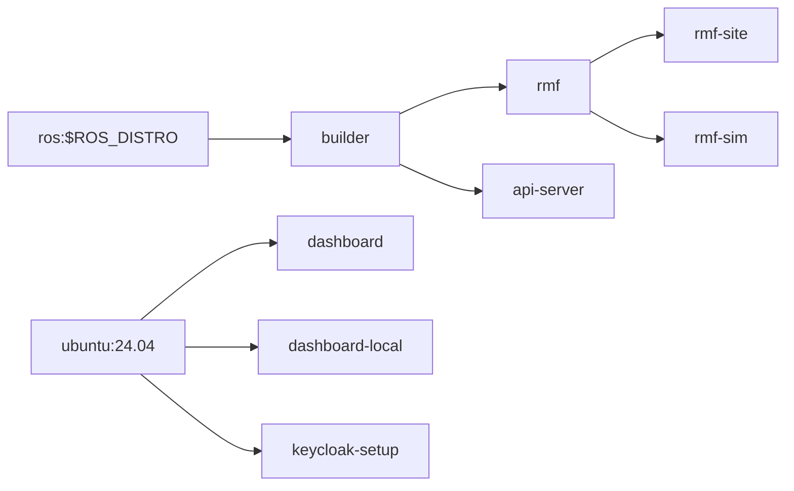

[](https://github.com/open-rmf/rmf_deployment_template/actions/workflows/build-images.yaml)

# Open-RMF Deployment Template
This repo provides a reference template to build, deploy and manage an [Open-RMF](https://github.com/open-rmf/rmf) installation for production use, in cloud as 
well as on-prem environments


<details>
<summary> ** Quick local deployment for testing, in lieu of kubernetes cluster **</summary>

If you are planning to run a small local deployment and do not want to setup up a kubernetes cluster for it OR run `rmf_demos` with simulation on your local machine.

```bash
docker-compose -f devel/docker-compose-local.yaml up -d
```

Now access the dashboard with: http://localhost:3000/dashboard and try dispatch a task.

</details>

## Build
If you are deploying on a public cloud, it is recommeded to use CI / CD pipelines; 
you may follow the github actions in this repo to setup CI.

<details>
<summary>(Alternate method) Manual build in liue of CI</summary>
To build dockerfiles for deployment manually, emulate the build steps in 

```bash
.github/workflows/build-images.yaml
```
</details>

<details>
<summary>Docker images structure</summary>


</details>

## Install kubernetes and setup infrastructure
There are various kubernetes distributions available, we will be using [k3s](https://k3s.io/) for this template; please feel free to use alternates you may be comfortable with.

```bash
# install docker
curl -fsSL get.docker.com -o get-docker.sh && sh get-docker.sh
sudo usermod -aG docker $USER
newgrp docker

# install k3s (https://docs.k3s.io/)
# replace ens5 with the interface of your choice 
curl -sfL https://get.k3s.io | INSTALL_K3S_EXEC="--flannel-iface=ens5 --disable=traefik --write-kubeconfig-mode=644 --docker" sh -s - 

# install helm (https://helm.sh/docs/intro/install/)
curl https://raw.githubusercontent.com/helm/helm/main/scripts/get-helm-3 | bash

# clone this repo
git clone git@github.com:open-rmf/rmf_deployment_template.git

# deploy infrastructure components
cd rmf_deployment_template/charts/
./infrastructure/tools/helm_charts_build.bash
export KUBECONFIG=/etc/rancher/k3s/k3s.yaml
helm install -n=infra --create-namespace rmf-infra infrastructure
```

<details>
<summary>Additional steps for Local/intranet in lieu of public/internet installation</summary>
If you are deploying locally, add your cluster's IP to `/etc/hosts` to point to be 
able to resolve https://rmf.test

```bash
sudo bash -c "echo $(kubectl get svc rmf-infra-ingress-nginx-controller -n infra -o jsonpath="{.spec.clusterIP}") rmf.test >> /etc/hosts"
```
</details>

## Setup SSL certifications

If you are deploying on the internet (eg. Cloud VM / managed cluser / etc), letsencrypt provides an easy way of obtaining SSL certificates
```bash
# IMPORTANT: Before you proceed to the next steps, make sure your DNS is indeed setup 
# and resolving; this is to avoid hitting letsencrypt's rate limits on DNS failure.
# NOTE: Specify your `ACME_EMAIL` and `DOMAIN_NAME` for letsencrypt-issuer-production
export DOMAIN_NAME=rmf.test
export ACME_EMAIL=YOUREMAIL@DOMAIN.com
envsubst < charts/infrastructure/tools/letsencrypt-issuer-production.yaml | kubectl apply -f -

# Verify if certificate was issued successfully.
kubectl get certificates # should be true, if not, might need to wait a couple minutes.
```

<details>
<summary>(Alternate method) Local/intranet in lieu of public/internet installation</summary>
If you are deploying locally (eg. on your computer / on-prem server / etc) the cluster provides a certification authority that signs different certificates used 
in different services by the cluster. The root ca certificate can be obtained by:

```bash
# create testing ca
kubectl apply -f devel/certs.yaml

# get the ca cert
kubectl -n=infra get secrets rmf-dev-secret --template='{{index .data "ca.crt"}}' | base64 -dw0 > ca.crt
```

**Browser https connections**

For self signed certificates, tell your browser to trust the ca.crt cert (instructions depends on the browser).
</details>

## Deploy

We will use [ArgoCD](https://argoproj.github.io/cd) to handle chart changes on this 
branch of the repository and apply to the cluster. The `charts` directory consists of 
[helm charts](https://helm.sh/docs/topics/charts/) which describes the provisioning 
of the deployment.

```bash
kubectl create namespace rmf
kubectl create namespace argocd
kubectl apply -n argocd -f https://raw.githubusercontent.com/argoproj/argo-cd/stable/manifests/install.yaml
kubectl port-forward svc/argocd-server -n argocd 9090:443
# If you get an error forwarding the port, it is likely that socat is unavailable
# on your machine, to fix - sudo apt -y install socat

# Start a new ssh session with port forward 9090 to the VM, you should now be able
# to view the admin panel on port localhost:9090 
# (eg. ssh -L 9090:localhost:9090 my-awesome-server.tld and then open ArgoCD web UI 
# by going to localhost:9090 on your workstation)
# In case you have problems with port forwarding, you may be missing socat on the 
# server, install by sudo apt install -y socat 

# Get the initial password for ArgoCD
kubectl -n argocd get secret argocd-initial-admin-secret -o jsonpath="{.data.password}" | base64 -d
```
For more on ArgoCD, vist their [readthedocs](https://argo-cd.readthedocs.io/en/stable/) page.
```bash
# Connect the repository

## When adding a "new app" on argocd, we will specify the repo, this branch and 
## `charts/rmf-deployment` directory. Similarly to deploy the monitoring tools, use 
## `charts/monitoring` directory.

## Now if you sync the app, we should see the full deployment "come alive"
```
<details>
<summary>(Alternate method) Manual deployment in lieu of CD</summary>
In case it is not feasible to deploy via CD, a manual deployment is possible via helm

```bash
# deploy monitoring stack
helm install -n=monitoring --create-namespace rmf-monitoring charts/monitoring

# install rmf stack
helm install -n=rmf --create-namespace rmf charts/rmf-deployment

# wait for keycloak to be ready
kubectl -n=rmf wait --for=condition=Complete --timeout=5m jobs keycloak-setup
```
</details>

## Grafana
The deployment includes a prometheus stack (with grafana). It can be accessed from
https://rmf.test/grafana.

To get the admin password, run

```
kubectl -n=monitoring get secrets rmf-monitoring-grafana -o=jsonpath='{.data.admin-password}' | base64 -d -
```

# Troubleshooting
<details>
<summary>Unable to list resources on kubectl cli</summary>
The kubeconfig file stored at `/etc/rancher/k3s/k3s.yaml` is used to configure access to the Kubernetes cluster. If you have installed upstream Kubernetes command line tools such as kubectl or helm you will need to configure them with the correct kubeconfig path. This can be done by either exporting the `KUBECONFIG` environment variable or by invoking the `--kubeconfig` command line flag. Refer to the examples below for details.

Leverage the KUBECONFIG environment variable:
```bash
export KUBECONFIG=/etc/rancher/k3s/k3s.yaml
kubectl get pods --all-namespaces
helm ls --all-namespaces
```
Or specify the location of the kubeconfig file in the command:
```bash
kubectl --kubeconfig /etc/rancher/k3s/k3s.yaml get pods --all-namespaces
helm --kubeconfig /etc/rancher/k3s/k3s.yaml ls --all-namespaces
```
</details>

<details>
<summary>List of ports and URIs used by the different services</summary>

| Service         | Port     | Port handled by     | Test Env IP | Production access      |
|-----------------|----------|---------------------|-------------|------------------------|
| RMF http        | 80       | ingress-nginx http  | 127.0.0.1   | http://${URL}/dashboard/ |
| RMF https       | 443      | ingress-nginx https | 127.0.0.1   | https://${URL}:443/dashboard/ |
| Grafana UI      | 443      | ingress-nginx https | cluster IP  | https://${URL}/grafana/ |
| Keycloak UI     | 443      | ingress-nginx https | cluster IP  | https://${URL}/auth/ |
</details>

<details>
<summary>Reserve node for production Deployment</summary>
To reserve a node for rmf.

```bash
kubectl taint node <node-name> reserved=rmf:NoSchedule
```
</details>

<details>
<summary>Deleting and Removing the local deployment / installation</summary>
To delete the local deployment

```bash
helm uninstall -n=rmf rmf
```
</details>

<details>
<summary>API server crash loop backoff and jwt-pub-key missing</summary>
It is generally normal for the first deployment to see this happening, as it has to wait 
for keycloak to be ready and the `keycloak-setup` job to be completed.

If this issue is persisting and the `keycloak-setup` job does not show up on `kubectl get jobs -A`,
it means the job was somehow not started. It can be manually spun up again using

```
helm upgrade rmf rmf-deployment -n rmf
```

The job should take less than a minute. Verify if `keycloak-setup` shows up again using

```
kubectl get jobs -A
```

and

```
kubectl get pods -n rmf
```

Restart the API server pod by running,

```
kubectl rollout restart deployments/rmf-web-rmf-server
```
</details>