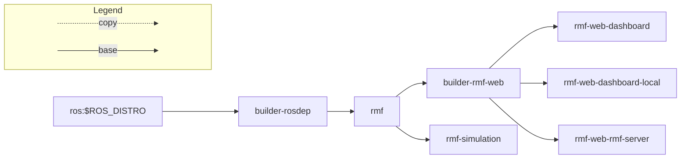

# Open-RMF Deployment Template
This repo provides a sample template to build, deploy and manage an [Open-RMF](https://github.com/open-rmf/rmf) installation (i.e. GitOps for RMF)


## The Kubernetes way for cloud deployment
This repo is structured as -
- `main` - Contains Dockerfiles and CI pipeline to build images for this example deployment
- [build/rmf-site](https://github.com/open-rmf/rmf_deployment_template/tree/build/rmf-site) - Contains example rmf-site related resources, dockerfiles and CI process
- [cloud_infra](https://github.com/open-rmf/rmf_deployment_template/tree/cloud_infra) - Cloud cluster bringup scripts, resources and runtime configs

_(These branches may be setup as independant repos for a production environment, the intent in having them as branches here is to provide a concise one-stop location for easy reference.)_

We will use the following tools for this example -
- CI : [Github actions](https://github.com/features/actions)
- Container registry: [Github packages](https://github.com/features/packages)
- VM hosting: [AWS EC2](https://aws.amazon.com/ec2/)
- DNS: [AWS Route 53](https://aws.amazon.com/route53/)
- Kubernetes distribution: [k3s](https://k3s.io)
- CD: [ArgoCD](https://argoproj.github.io/cd)

Run thru the setups in `cloud_infra` branch to deploy these images to a cloud instance and access Open-RMF web dashbaord over a public URL

## Alternate method for quick local deployment
If you are planning to run a small local deployment and do not want to setup up a kubernetes cluster for it OR run `rmf_demos` with simulation on your local machine.

```bash
docker run --network=host \
-it ghcr.io/open-rmf/rmf_deployment_template/rmf-simulation:latest \
bash -c "ros2 launch rmf_demos_gz office.launch.xml \
headless:=1 \
server_uri:=ws://localhost:8000/_internal"
```

Run `rmf-api-server`
```bash
docker run --network=host \
-it ghcr.io/open-rmf/rmf_deployment_template/rmf-web-rmf-server:latest
```

Run `rmf-web-dashboard`
```bash
docker run -p 3000:80 \
-it ghcr.io/open-rmf/rmf_deployment_template/rmf-web-dashboard-local:latest
```

Now access the dashboard with: http://localhost:3000/dashboard and try dispatch a task.


### Docker images structure

### Building images
You can look into the github workflow to get an idea of how to build images:
[Github Workflow](https://github.com/open-rmf/rmf_deployment_template/blob/main/.github/workflows/docker-image.yml).

From the root directory of this repo, you can run the following commands to build the images:
```
# Install and run vcs import rmf
curl -sSL https://raw.githubusercontent.com/ros/rosdistro/master/ros.key  -o /usr/share/keyrings/ros-archive-keyring.gpg
echo "deb [arch=$(dpkg --print-architecture) signed-by=/usr/share/keyrings/ros-archive-keyring.gpg] http://packages.ros.org/ros2/ubuntu $(lsb_release -cs) main" | \
sudo tee /etc/apt/sources.list.d/ros2.list > /dev/null
sudo apt update
sudo apt install python3-vcstool -y
mkdir rmf-src
vcs import rmf-src < rmf/rmf.repos
```
```
ROS_DISTRO="${ROS_DISTRO:-humble}"
docker build -f rmf/builder-rosdep.Dockerfile -t open-rmf/rmf_deployment_template/builder-rosdep .
docker build -f rmf/rmf.Dockerfile -t open-rmf/rmf_deployment_template/rmf .
```
