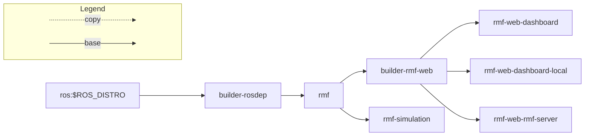

[](https://github.com/open-rmf/rmf_deployment_template/actions/workflows/build-images.yaml)

# Open-RMF Deployment Template
This repo provides a reference template to build, deploy and manage an [Open-RMF](https://github.com/open-rmf/rmf) installation for production use, in cloud as 
well as on-prem environments


## The Kubernetes way of deployment

### Build
#### CI
If you are deploying on a public cloud, it is recommeded to use CI / CD pipelines; 
you may follow the github actions in this repo to setup CI.

#### (Alternate method) Manual
To build manually, follow the steps in `.github/workflows/build-images.yaml` to build dockerfiles for deployment.

### Install kubernetes and setup infrastructure
There are various kubernetes distributions available, we will be using [k3s](https://k3s.io/) for this template; please feel free to use alternates you may be comfortable with.

```bash
# install docker
curl -fsSL get.docker.com -o get-docker.sh && sh get-docker.sh
sudo usermod -aG docker $USER
newgrp docker

# install k3s (https://docs.k3s.io/)
curl -sfL https://get.k3s.io | INSTALL_K3S_EXEC="--flannel-iface=ens5 --disable=traefik --write-kubeconfig-mode=644 --docker" sh -s - 

# install helm (https://helm.sh/docs/intro/install/)
curl https://raw.githubusercontent.com/helm/helm/main/scripts/get-helm-3 | bash

# clone this repo
git clone -b deploy git@github.com:open-rmf/rmf_deployment_template.git

# deploy infrastructure components
cd rmf_deployment_template/charts/
./infrastructure/tools/helm_charts_build.bash
helm install -n=infra --create-namespace rmf-infra infrastructure
```

If you are deploying locally, add your cluster's IP to `/etc/hosts` to point to be 
able to resolve https://rmf.test
```bash
sudo bash -c "echo $(kubectl get svc rmf-infra-ingress-nginx-controller -n infra -o jsonpath="{.spec.clusterIP}") rmf.test >> /etc/hosts"
```

### Setup SSL certifications

#### Installation on public cloud
If you are deploying on the internet (eg. Cloud VM / managed cluser / etc), letsencrypt provides an easy way of obtaining SSL certificates
```bash
# IMPORTANT: Before you proceed to the next steps, make sure your DNS is indeed setup 
# and resolving; this is to avoid hitting letsencrypt's rate limits on DNS failure.
# NOTE: Specify your `ACME_EMAIL` and `DOMAIN_NAME` for letsencrypt-issuer-production
export DOMAIN_NAME=rmf.test
export ACME_EMAIL=YOUREMAIL@DOMAIN.com
envsubst < charts/infrastructure/tools/letsencrypt-issuer-production.yaml | kubectl apply -f -

# Verify if certificate was issued successfully.
kubectl get certificates # should be true, if not, might need to wait a couple minutes.
```
#### (Alternate method) Local installation
If you are deploying locally (eg. on your computer / on-prem server / etc) the cluster provides a certification authority that signs different certificates used 
in different services by the cluster. The root ca certificate can be obtained by:
```bash
# create testing ca
kubectl apply -f devel/certs.yaml

# get the ca cert
kubectl -n=infra get secrets rmf-dev-secret --template='{{index .data "ca.crt"}}' | base64 -dw0 > ca.crt
```

##### Browser https connections
For self signed certificates, tell your browser to trust the ca.crt cert (instructions depends on the browser).

### DEPLOY

#### CD
We will use [ArgoCD](https://argoproj.github.io/cd) to handle chart changes on this 
branch of the repository and apply to the cluster. The `charts` directory consists of 
[helm charts](https://helm.sh/docs/topics/charts/) which describes the provisioning 
of the deployment.

```bash
kubectl create namespace rmf
kubectl create namespace argocd
kubectl apply -n argocd -f https://raw.githubusercontent.com/argoproj/argo-cd/stable/manifests/install.yaml
kubectl port-forward svc/argocd-server -n argocd 9090:443

# Start a new ssh session with port forward 9090 to the VM, you should now be able
# to view the admin panel on port localhost:9090 
# (eg. ssh -L 9090:localhost:9090 my-awesome-server.tld and then open ArgoCD web UI 
# by going to localhost:9090 on your workstation)
# In case you have problems with port forwarding, you may be missing socat on the 
# server, install by sudo apt install -y socat 

# Get the initial password for ArgoCD
kubectl -n argocd get secret argocd-initial-admin-secret -o jsonpath="{.data.password}" | base64 -d
```
For more on ArgoCD, vist their [readthedocs](https://argo-cd.readthedocs.io/en/stable/) page.
```bash
# Connect the repository

## When adding a "new app" on argocd, we will specify the repo, this branch and 
## `charts/rmf-deployment` directory. Similarly to deploy the monitoring tools, use 
## `charts/monitoring` directory.

## Now if you sync the app, we should see the full deployment "come alive"
```

#### (Alternate method) Manual deployment
In case it is not feasible to deploy via CD, a manual deployment is possible via helm

```bash
# deploy monitoring stack
helm install -n=monitoring --create-namespace rmf-monitoring charts/monitoring

# install rmf stack
helm install -n=rmf --create-namespace rmf charts/rmf-deployment

# wait for keycloak to be ready
kubectl -n=rmf wait --for=condition=Complete --timeout=5m jobs keycloak-setup
```

### Grafana (using Prometheus and Loki)
The deployment includes a prometheus stack (with grafana). It can be accessed from
https://rmf.test/grafana.

To get the admin password, run

```
kubectl -n=monitoring get secrets rmf-monitoring-grafana -o=jsonpath='{.data.admin-password}' | base64 -d -
```

## (Alternate method) Quick local deployment
If you are planning to run a small local deployment and do not want to setup up a kubernetes cluster for it OR run `rmf_demos` with simulation on your local machine.

```bash
docker run --network=host \
-it ghcr.io/open-rmf/rmf_deployment_template/rmf-deployment/rmf-simulation:latest \
bash -c "ros2 launch rmf_demos_gz office.launch.xml \
headless:=1 \
server_uri:=ws://localhost:8000/_internal"
```

Run `rmf-api-server`
```bash
docker run --network=host \
-it ghcr.io/open-rmf/rmf_deployment_template/rmf-deployment/rmf-web-rmf-server:latest
```

Run `rmf-web-dashboard`
```bash
docker run -p 3000:80 \
-it ghcr.io/open-rmf/rmf_deployment_template/rmf-deployment/rmf-web-dashboard-local:latest
```

Now access the dashboard with: http://localhost:3000/dashboard and try dispatch a task.


### Docker images structure


  
# Troubleshooting

### Services

List of ports and URIs used by the different services:

| Service         | Port     | Port handled by     | Test Env IP | Production access      |
|-----------------|----------|---------------------|-------------|------------------------|
| RMF http        | 80       | ingress-nginx http  | 127.0.0.1   | http://${URL}          |
| RMF https       | 443      | ingress-nginx https | 127.0.0.1   | https://${URL}:443     |
| Grafana UI      | 443      | ingress-nginx https | cluster IP  | https://${URL}/grafana/ |
| Keycloak UI     | 443      | ingress-nginx https | cluster IP  | https://${URL}/auth/ |

### Production Deployment

To reserve a node for rmf.

```bash
kubectl taint node <node-name> reserved=rmf:NoSchedule
```

### Deleting and Removing the local deployment / installation

To delete the local deployment

```bash
helm uninstall -n=rmf rmf
```

To delete the entire cluster

```bash
minikube delete -p dev
```

### API server crash loop backoff and jwt-pub-key missing

It is generally normal for the first deployment to see this happening, as it has to wait 
for keycloak to be ready and the `keycloak-setup` job to be completed.

If this issue is persisting and the `keycloak-setup` job does not show up on `kubectl get jobs -A`,
it means the job was somehow not started. It can be manually spun up again using

```
helm upgrade rmf rmf-deployment -n rmf
```

The job should take less than a minute. Verify if `keycloak-setup` shows up again using

```
kubectl get jobs -A
```

and

```
kubectl get pods -n rmf
```

Restart the API server pod by running,

```
kubectl rollout restart deployments/rmf-web-rmf-server
```